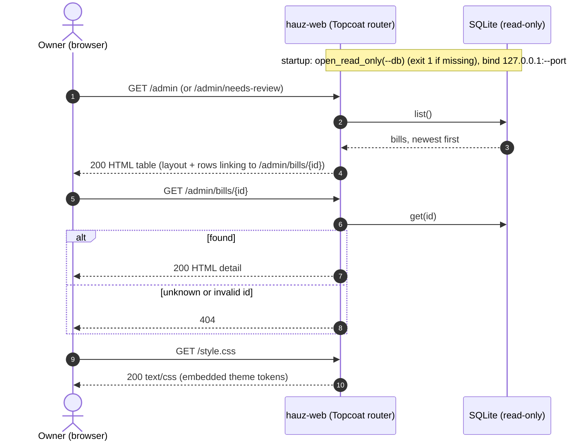

# hauz-web admin request

*Verified against: `unaudited`*

`hauz-web` serves server-rendered pages on `127.0.0.1`, without authentication, from a
database opened read-only at startup.

```mermaid
sequenceDiagram
    autonumber
    actor O as Owner (browser)
    participant W as hauz-web (Topcoat router)
    participant D as SQLite (read-only)
    Note over W,D: startup: open_read_only(--db) (exit 1 if missing), bind 127.0.0.1:--port
    O->>W: GET /admin  (or /admin/needs-review)
    W->>D: list()
    D-->>W: bills, newest first
    W-->>O: 200 HTML table (layout + rows linking to /admin/bills/{id})
    O->>W: GET /admin/bills/{id}
    W->>D: get(id)
    alt found
        W-->>O: 200 HTML detail
    else unknown or invalid id
        W-->>O: 404
    end
    O->>W: GET /style.css
    W-->>O: 200 text/css (embedded theme tokens)
```
